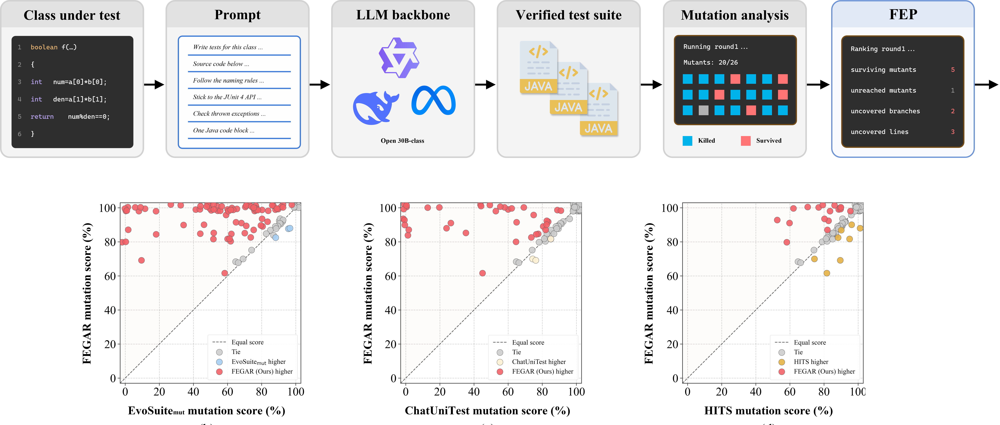

<h1>
  <p align=center> FEGAR: Fault Evidence Guided Assured Refinement for Unit Test Generation with Locally Deployable LLMs </p>
<div align="center">


</div>
</h1>


FEGAR refines a JUnit 4 test suite through rounds of generation and measurement. Execution
grounded validation (EGV) admits a test only after it compiles and passes on the class under
test, repairing it first when it fails. Verified progress consolidation (VPC) keeps every
verified test across rounds, fault evidence prioritization (FEP) places surviving and uncovered
mutants ahead of uncovered branches and lines in the next prompt, and monotonic outcome
assurance (MOA) delivers the best measured suite. Validation, memory, and prioritization
therefore run in deterministic testing infrastructure, which leaves the backbone with test
synthesis alone and lets the loop run on a single GPU.

## Availability

This repository accompanies a manuscript under review. It releases the per-subject final
mutation scores behind the main comparisons of the paper, together with a script that
recomputes them:

| File | Content |
|---|---|
| `data/main_scores.csv` | Success and final mutation score of the seven approaches in Table 3, per subject, on HumanEval-Java and LeetCode-Java |
| `data/backbone_scores.csv` | Success and final mutation score of vanilla prompting and FEGAR on the seven backbones, per subject |
| `data/d4j_scores.csv` | Success and final mutation score of EvoSuite, vanilla prompting, and FEGAR on the 83 Defects4J classes |
| `verify_main_results.py` | Recomputes these results and their statistical tests and compares every value with the paper |

Subjects are identified by codes (`HE-001`, `LC-001`, `D4J-001`), which pair the runs of the
same subject across approaches. The generation pipeline, the complete per-subject records, the
subject lists and their perturbed counterparts, and the scripts for the remaining tables will
be released upon acceptance; during the review, they are available to the editor and the
reviewers on request.

## Verifying the main results

```shell
git clone https://github.com/wanq501/FEGAR.git
cd FEGAR
python3 verify_main_results.py
```

The script needs only the Python standard library. It prints each recomputed value next to the
value reported in the paper, 186 values in total: the success rate and mutation score of every
approach in Table 3 with the paired comparison against FEGAR, the seven-backbone comparison with
vanilla prompting, and the Defects4J comparison. Comparisons are paired at the subject level and
use the two-sided Wilcoxon signed-rank test for mutation scores, the exact McNemar test for
success, and the Vargha and Delaney A12 effect size; the confirmatory family of 32 tests is
judged under Bonferroni correction.

## Benchmarks

| Benchmark | Subjects | Mutants | Perturbed | Description |
|---|---|---|---|---|
| [HumanEval-Java](https://github.com/lin-tan/clm) | 104 | 1,167 | 50 | Self-contained classes at the method level, the 104-subject selection released with MUTGEN |
| LeetCode-Java | 100 | 1,860 | 50 | 50 Medium and 50 Hard problems from public LeetCode solutions, reconstructed with the construction protocol of MUTGEN |
| [Defects4J](https://github.com/rjust/defects4j) | 83 | &mdash; | &mdash; | Real-world classes with project-level dependencies from Math, Lang, Collections, Compress, and Csv |

Mutants are generated by PIT 1.15.3 with the DEFAULTS operator group.

## Results

Qwen2.5-Coder-32B backbone, every approach measured under the same harness. A subject without
a valid test scores zero on every metric except TS, which is averaged over the subjects whose
suite covers at least one mutant. Bold marks the best value of each column within a benchmark,
ties included, and * marks p < 0.05 for the paired comparison with FEGAR.

<table>
  <thead align="center">
    <tr>
      <th>Benchmark</th><th>Approach</th><th>Succ.</th><th>Exec.</th><th>Line</th><th>Branch</th><th>MS</th><th>TS</th><th>A12</th><th>Tests</th>
    </tr>
  </thead>
  <tbody align="center">
    <tr>
      <td rowspan="7">HumanEval-Java</td>
      <td>EvoSuite</td><td><b>100.0</b></td><td><b>100.0</b></td><td><b>96.9</b></td><td>95.9</td><td>64.4</td><td>67.8</td><td>0.87*</td><td>5.9</td>
    </tr>
    <tr>
      <td>EvoSuite<sub>mut</sub></td><td>98.1</td><td>98.1</td><td>94.7</td><td>93.6</td><td>62.8</td><td>66.8</td><td>0.88*</td><td>4.1</td>
    </tr>
    <tr>
      <td>ChatUniTest</td><td>91.3</td><td>91.3</td><td>81.0</td><td>86.7</td><td>76.5</td><td>85.6</td><td>0.65*</td><td>5.1</td>
    </tr>
    <tr>
      <td>HITS</td><td><b>100.0</b></td><td><b>100.0</b></td><td>89.3</td><td><b>98.8</b></td><td>91.2</td><td>91.9</td><td>0.55*</td><td>36.4</td>
    </tr>
    <tr>
      <td>MUTGEN <sup>a</sup></td><td>99.0</td><td>99.0</td><td>87.2</td><td>94.8</td><td>85.8</td><td>88.0</td><td>0.62*</td><td>20.4</td>
    </tr>
    <tr>
      <td>Vanilla</td><td>91.3</td><td>38.5</td><td>81.3</td><td>89.7</td><td>83.4</td><td>92.1</td><td>0.58*</td><td>7.3</td>
    </tr>
    <tr>
      <td><b>FEGAR</b></td><td><b>100.0</b></td><td><b>100.0</b></td><td>92.4</td><td>98.3</td><td><b>93.4</b></td><td><b>93.6</b></td><td>0.50</td><td>13.2</td>
    </tr>
    <tr>
      <td rowspan="7">LeetCode-Java</td>
      <td>EvoSuite</td><td>92.0</td><td>92.0</td><td>90.8</td><td>90.0</td><td>66.1</td><td>76.7</td><td>0.74*</td><td>5.3</td>
    </tr>
    <tr>
      <td>EvoSuite<sub>mut</sub></td><td>95.0</td><td>95.0</td><td>93.7</td><td>92.6</td><td>70.6</td><td>77.5</td><td>0.72*</td><td>3.5</td>
    </tr>
    <tr>
      <td>ChatUniTest</td><td>61.0</td><td>61.0</td><td>56.3</td><td>54.7</td><td>45.3</td><td>80.9</td><td>0.82*</td><td>3.0</td>
    </tr>
    <tr>
      <td>HITS</td><td>88.0</td><td>88.0</td><td>85.1</td><td>82.3</td><td>75.0</td><td>87.0</td><td>0.59*</td><td>28.8</td>
    </tr>
    <tr>
      <td>MUTGEN <sup>a</sup></td><td>96.0</td><td>96.0</td><td>85.4</td><td>82.7</td><td>74.3</td><td>86.5</td><td>0.64*</td><td>17.3</td>
    </tr>
    <tr>
      <td>Vanilla</td><td>88.0</td><td>10.0</td><td>82.4</td><td>79.2</td><td>68.1</td><td>81.7</td><td>0.72*</td><td>5.2</td>
    </tr>
    <tr>
      <td><b>FEGAR</b></td><td><b>100.0</b></td><td><b>100.0</b></td><td><b>98.8</b></td><td><b>96.1</b></td><td><b>90.0</b></td><td><b>90.5</b></td><td>0.50</td><td>14.6</td>
    </tr>
  </tbody>
</table>

<sup>a</sup> MUTGEN runs with its official implementation on full-precision Llama-3.3-70B, the
backbone it was released with. ChatUniTest 2.1.1 and HITS run with their official
implementations on the primary backbone.

**Defects4J (83 real-world classes).**

| Approach | Success | MS | TS | Tests |
|---|---|---|---|---|
| EvoSuite | 98.8 | 52.5 | 72.8 | 26.4 |
| Vanilla | 39.8 | 22.3 | 80.0 | 4.0 |
| **FEGAR** | 98.8 | 65.5 | 83.4 | 15.4 |

**Mutation score of vanilla prompting and FEGAR on seven backbones.**

| Backbone | HumanEval-Java | LeetCode-Java |
|---|---|---|
| Qwen2.5-Coder-32B | 83.4 → **93.4** | 68.1 → **90.0** |
| DeepSeek-Coder-33B | 65.8 → **83.1** | 27.3 → **72.0** |
| CodeLlama-34B | 31.3 → **86.5** | 13.2 → **43.3** |
| Llama-3.3-70B | 75.4 → **93.0** | 57.9 → **87.5** |
| Claude Sonnet 5 | 79.0 → **95.1** | 44.8 → **92.6** |
| GPT-5.6 Sol | 92.6 → **95.5** | 83.2 → **95.8** |
| Gemini 3.1 Pro | 62.8 → **93.0** | 38.2 → **86.1** |

## Runtime

| Item | Setting |
|---|---|
| GPU | NVIDIA RTX PRO 6000 with 96 GB, one card for the 30B backbones and two with tensor parallelism for the 70B model |
| Serving | vLLM OpenAI-compatible server for the open backbones; proprietary models through their APIs |
| Loop | at most 4 rounds in total, 8 evidence items per prompt, at most 6 new tests per round |
| Runtime | JDK 11, Maven, JUnit 4.13.2, JaCoCo 0.8.11, PIT 1.15.3, EvoSuite 1.2.0 |

## Citation

The paper is under review. Citation information will be added upon publication.

This project builds on the open source mutation testing tool [PIT (Pitest)](https://github.com/hcoles/pitest).

```
@inproceedings{PIT,
  author={Henry Coles and Thomas Laurent and Christopher Henard and Mike Papadakis and Anthony Ventresque},
  title={PIT: a practical mutation testing tool for Java (demo)},
  booktitle={Proceedings of the 25th International Symposium on Software Testing and Analysis},
  pages={449--452},
  year={2016}
}
```

It also uses the [HumanEval-Java](https://github.com/lin-tan/clm) dataset

```
@inproceedings{HumanEval-Java,
  title={Impact of Code Language Models on Automated Program Repair},
  author={Nan Jiang and Kevin Liu and Thibaud Lutellier and Lin Tan},
  booktitle={Proceedings of the 45th IEEE/ACM International Conference on Software Engineering},
  pages={1430--1442},
  year={2023}
}
```

and the [Defects4J](https://github.com/rjust/defects4j) database.

```
@inproceedings{Defects4J,
  title={Defects4J: A Database of Existing Faults to Enable Controlled Testing Studies for Java Programs},
  author={Ren{\'e} Just and Darioush Jalali and Michael D. Ernst},
  booktitle={Proceedings of the International Symposium on Software Testing and Analysis},
  pages={437--440},
  year={2014}
}
```

Copyright (c) 2026 the authors. All rights reserved until publication.
